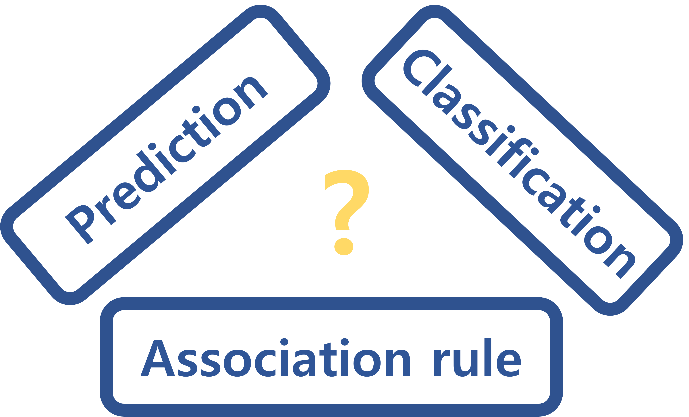
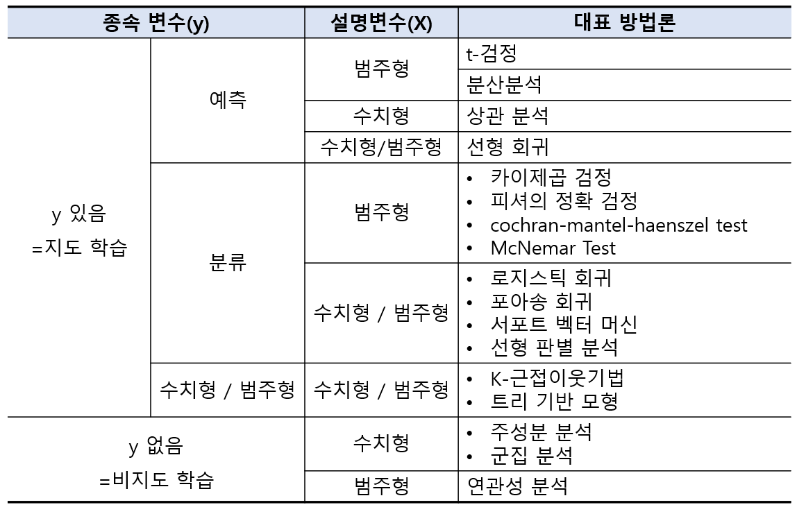

---
# 1. 데이터마이닝


데이터 마이닝 발전의 가장 주요한 동력은 데이터의 증가이다. 경제와 지식기반의 확장이 원인이라기 보다는 저렴한 데이터 수집 수단, 유무선 통신 네트워크를 통한 빠르고 저렴한 데이터 전달, 클라우드 컴퓨팅을 활용한 대용량 데이터 저장능력이 데이터 마이닝의 발전과 빅데이터 산업의 발전을 이끌었다.

이번 내용에서는 데이터를 활용한 분석 방법인 머신러닝(Machine Learning, ML) 알고리즘에 대한 설명에 앞서 그에 기본이 되는 데이터 마이닝에 대한 설명을 하고자한다.

---
# 2. 주요 사용처


**데이터 마이닝은 주로 어디에 쓰이는가?**

1. 수많은 잠재 고객 중 어떤 사람들이 구매를 할 것인지 예측한다.
2. 어떤 고객이 대출 연체 혹은 체납할 지 예측하고 대출 심사시 높은 강도의 심사를 진행한다.
3. 어던 고객들이 구독서비스를 중단할지 계산하고, 대상에게 할인이나 기타 구매 유인책을 제시한다.


---
# 3. 주요 용어

**데이터 마이닝은 여러 학문에서 사용되기 때문에 같은 말을 종종 다른 용어로 부르는 일이 많다**.

**알고리즘** : 특정한 데이터 마이닝 기을 실행하기 위한 자세한 과정

**케이스** : 하나의 단위로 취급되는 자료의 집합(≒ 레코드, 관측값)

**독립변수(X)** : 다른 변수에 영향을 주는 변수(≒ 설명변수, 입력변수, 예측변수, feature

**종속변수(y)** : 다른 변수로부터 영향을 받는 변수(≒ 반응변수, 출력변수, 결과변수, label, target

**지도학습** : 종속변수(y)를 아는 레코드를 알고리즘에 적용시키는 과정을 말한다.

**비지도학습** : 종속변수(y)를 알지 못하고, 해당 레코드에 대해 무엇인가를 알아보려는 시도를 말한다.(군집 등)

**훈련데이터** : 모델을 구축하는데 사용하는 데이터의 일부분을 말한다.

**테스트 데이터** : 모델 구축과 선택의 마지막 단계에서 최종 모델이 새롭게 추가되는 데이터를 얼마나 잘 예측하는지 평가하는 데 쓰는 데이터의 일부분을 말한다.

**검증 데이터** : 모델이 얼마나 적합한지를 평가하고, 모델을 조절하고, 시도한 분석 중 가장 최적의 모델을 선택할 때 쓰이는 데이터의 일부분을 말하며, 생략되는 경우도 있다.


---
# 4. 데이터 마이닝 단계

1. **데이터 마이닝 프로젝트의 목적을 명확하고 정확하게 설정**
2. **분석에 필요한 데이터의 획득** : 데이터는 보통 데이터베이스에서 무작위로 추출할 수도 있지만 때때로 서로 다른 두 개의 데이터베이스에서 따로 추출하여 통합하기도 한다. 내부 데이터베이스(소비자들의 구매이력)를 사용할 수도 있고 외부 데이터베이스(신용등급)를 사용할 수도 있다.
3. **데이터의 탐색, 정제, 전처리** : 본격적인 데이터 분석을 하기 위한 준비가 되어있는지 확인하는 단계. 결측치의 처리, 레코드들이 상식적인 범위 내에 있는지, 적저한 수치를 갖고 있는지, 이상치는 없는지를 파악한다. 주로 그래프를 이용해 효과적으로 파악한다.
4. **데이터 축소 또는 지도학습의 경우 train, test, vaildation 데이터로 분할** : 이 과정에는 불필요한 변수의 제거, 변수값의 변환, 새로운 변수 추출작업이 포함된다
5. **문제 결정** : 일반적인 문제(1단계에서 제기된 질문)를 특정한 통계적인 문제로 바꾸는 단계이다.(분류, 예측, 군집 등)
6. **사용할 데이터 마이닝 기법 선택** : 회귀, 인공신경망, 계층군집 등
7. **알고리즘을 사용하여 과제를 수행** : 데이터 마이닝 프로세스의 여러 단계를 반복적으로 수행하며 가장 좋은 모델을 찾는 단계이다. 보통 검증 데이터를 이용하여 가장 좋은 성능을 내는 모델의 parameter를 결정한다.
8. **알고리즘 결과의 해석** : 가장 효율적인 알고리즘을 찾아내고, 검증 데이터를 이용하여 구축된 알고리즘의 성능을 평가한다.
9. **모델 적용** : 구축된 모델을 운용 시스템에 탑재하여 실제 의사 결정에 적용하는 단계  

이 외에도 SAS의 SEMMA, IBM의 CRISP-DM이라는 데이터 마이닝 단계가 존재한다.


---