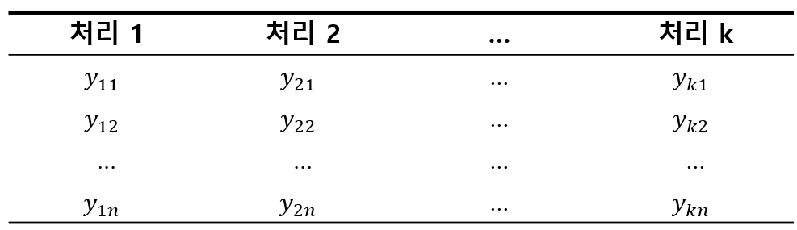
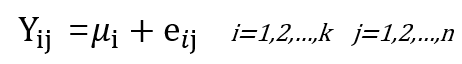
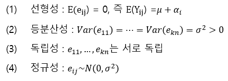
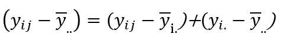
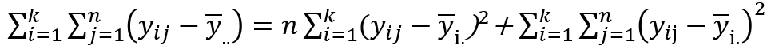
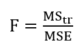
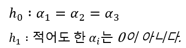

<br/>

**분산분석**<br/>

이번 포스팅에서는 데이터 마이닝의 프레임워크 중 분산분석에 대해 알아보고자 한다.

분산분석은 그룹의 수가 3개 이상인 경우 연속형 종속 변수의 평균 차이가 있는지 검정하는 방법이다.  
즉, 3개 이상의 처리효과를 비교하는 것에 관심이 있는 것으로 2개의 처리효과를 비교하는 t-검정의 확장이라고 볼 수 있다.

분산분석의 유형에는  
1. 일원배치분산분석(one-way ANOVA)
2. 이원배치분산분석(two-way ANOVA)
3. 다원배치분산분석(multi-way ANOVA)
4. 다변량 분산분석(multivariate ANOVA, MANOVA)
5. 공분산분석(analysis of covariance, ANCOVA)
6. 다변량 공분산분석(multivariate analsis of covaraince, MANCOVA)가 있다.

가장 기본이 되는 일원배치분산분석에 대해 알아보자 <br/><br/>

---

# 1. 일원배치분산분석 <br/>

앞서 말한 것 처럼 일원배치분산분석은 3개 이상의 집단을 비교하는 것이 목적이며,  
보통 3~5개의 집단(k)을 사용하고 평균을 비교하기 위한 반복수(n)는 3~10가 많이 사용된다.  
<span style="color=gray"> ※ 반복수는 동일하지 않아도 된다. </span>

일원배치법의 자료구조는 다음과 같다.
{: .align-center  width="70%" height="70%"}

k개의 처리효과를 통계적으로 비교하기 위해서는 각 처리에 대한 모집단모형이 필요한데,  
이때 각 그룹은 정규분포에서의 크기가 n인 확률 표본으로 가정한다.

{: .align-center  width="40%" height="40%"}<br/>
즉, 위의 식과 같이 나타낼 수 있다. 여기서의 e_ij는 실험에 대한 오차에 해당하는 확률변수로 아래와 같은 4가지 가정을 따른다.
{: .align-center  width="50%" height="50%"}<br/>
이후에는 k개의 처리효과간에 유의한 차이가 있는지는 k개의 모평균 사이에 차이가 있는지를 검정하는지와 같다.  
k개의 모평균 사이에 차이가 있는지를 검정하는 것은 관측값y_ij와 관측값의 총평균의 차이를 비교하는 것과 같은데  
관측값 y_ij와 총평균의 차이는 (y_ij - y^bar_..)으로 나타낼 수 있고, 다음과 같이 분해할 수 있다. <br/>

{: .align-center  width="35%" height="35%"}<br/>
우항에서 첫번째 식은 실험에서 불확실성을 나타내는 오차를 의미하며 잔차라고도 한다.  
우항에서 두번째 식은 i번째 처리의 평균과 총평균의 편차로 처리효과의 편차라고 한다.  
위 식에서 양변을 제곱하여 더하면 아래와 같은 식이 나오고 왼쪽에서 순서대로 총제곱합(SST), 처리제곱합(SStr), 잔차제곱합(SSE)로 나타낸다.  
그리고 각각의 자유도는 관측값의 총 개수가 N=kn일 때, SST의 자유도는 N-1, SStr의 자유도는 k-1, SSE의 자유도는 N-k로 알려져 있다.  <br/>

{: .align-center  width="60%" height="60%"}<br/>
제곱합을 자유도로 나눈 것을 평균제곱이라고 하며, F 검정통계량을 통해 처리효과의 유의성에 따져볼 수 있다.  
자세히 설명하면 만약 처리효과가 유의하다면 처리제곱합 SStr이 차지하는 비중이 커지고, 잔차제곱합 SSE가 차지하는 비중은 작아질 것이다.  
따라서 F의 값이 커질수록 처리효과가 유의하다는 증거가 되는 것이다.  <br/>
{: .align-center  width="15%" height="15%"}<br/><br/>

## 1.1 일원배치분산분석 예제
생닭가슴살에 훈제, 수비드, 삶기 방식이 닭가슴살의 부드러움의 차이를 만드는지 알아보자  
한정된 시간 안에서 각 가공방식의 조리시간이 각기 달라 훈제의 경우 40번, 수비드 30번, 삶기 50번을 실시했다고 가정한다.

**1단계 : 가설설정** <br/>
{: .align-center  width="35%" height="35%"} <br/>
**2단계 : 등분산 검정**
```python
# 훈제, 수비드, 삶기 방식을 각각 반복수 40, 30, 50으로 부드러움 측정한 데이터 생성
smoked = np.random.uniform(low=40, high=50, size=40 ).tolist()
sousvide = np.random.uniform(low=55, high=65, size=30 ).tolist()
boil = np.random.uniform(low=45, high=55, size=50 ).tolist()

# 등분산 검정
stats.levene(smoked, sousvide, boil)

# 결과
# LeveneResult(statistic=0.7981065471644461, pvalue=0.4526159345545824)
```
등분산성을 만족한다. <br/>

**3단계 : 유의성 검정**
```pyhton
import numpy as np
from scipy import stats

# 훈제, 수비드, 삶기 방식을 각각 반복수 40, 30, 50으로 부드러움 측정한 데이터 생성
smoked = np.random.uniform(low=40, high=50, size=40 ).tolist()
sousvide = np.random.uniform(low=55, high=65, size=30 ).tolist()
boil = np.random.uniform(low=45, high=55, size=50 ).tolist()

# 일원배치분산분석
stats.f_oneway(smoked, sousvide, boil)

# 결과
# F_onewayResult(statistic=216.11004881493923, pvalue=5.172580796784008e-40)
```
결과적으로 F값이 매우크고, p-value가 0.05 보다 작으므로 귀무가설을 기각하고 각 처리효과의 차이가 존재한다고 볼 수 있다.  
하지만 가설설정에서도 알 수 있듯이 어느 조리방식이 닭가슴살의 부드러움을 극대화 시키는지는 판단할 수 없다. <br/>

**4단계 : 그룹별 비교, 사후검정(Post Hoc Analysis)**

일반적으로 사후검정에는 Tukey's HSD, Duncan's new multiple range test, Scheffe's method, Bonferroni metod가 있다.  
차이 유무를 판정하는 민감도는 Scheffe < Bonferroni < Tukey < Duncan 순이다.

우리 예제에서 응용 범위가 가장 넓은 Bonferroni method를 이용하여 사후 검정을 해보자.

```python
import numpy as np
import pandas as pd
from scipy import stats
import scipy.stats
from statsmodels.sandbox.stats.multicomp import MultiComparison

# 훈제, 수비드, 삶기 방식을 각각 반복수 40, 30, 50으로 부드러움 측정한 데이터 생성
smoked = np.random.uniform(low=40, high=50, size=40 ).tolist()
sousvide = np.random.uniform(low=55, high=65, size=30 ).tolist()
boil = np.random.uniform(low=45, high=55, size=50 ).tolist()

# Bonferroni 사후검정
smoked = pd.DataFrame({ "soft" : np.random.uniform(low=40, high=50, size=40 ).tolist(), "type" : 1})
sousvide = pd.DataFrame({ "soft" : np.random.uniform(low=55, high=65, size=30 ).tolist(), "type" : 2})
boil = pd.DataFrame({ "soft" : np.random.uniform(low=45, high=55, size=50 ).tolist(), "type" : 3})
data = smoked.append([sousvide,boil])

comp = MultiComparison(data['soft'], data['type'])

result = comp.allpairtest(scipy.stats.ttest_ind, method='bonf')
pd.read_html(result[0].as_html())

# 결과
# [   group1  group2     stat  pval  pval_corr  reject
 0       1       2 -21.6659   0.0        0.0    True
 1       1       3  -9.0747   0.0        0.0    True
 2       2       3  13.6450   0.0        0.0    True]

```
 
Bonferroni 사후검정 결과 훈제, 수비드, 삶기의 3 그룹에서 2그룹씩 묶이는 경우의 수는 3C2=3가지로  
모든 경우에서 부드러움의 차이가 있다고 사후검정 결과 나타났다.  

어떤 조리방식이 부드러움을 극대화하는지는 세 그룹에서 부드러움의 차이가 통계적으로 유의하다고 나타났으므로  
기술통계와 시각화를 통해 비교하면서 부드러움을 비교하면 된다.<br/><br/>

**나머지 분산분석은 나중에!**

---