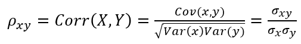
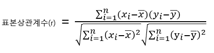
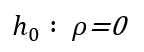
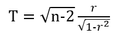
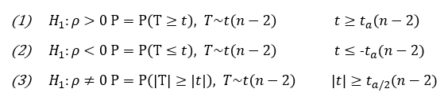
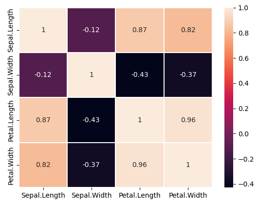
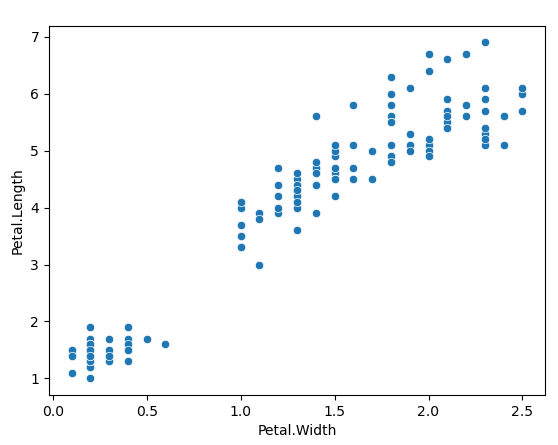

<br/>

# **상관분석**

이번 포스팅에서는 데이터 마이닝의 프레임워크 중 상관분석 대해 알아보고자 한다.

상관분석은 두 변수 사이의 관계유무나 관계의 강도에 대한 분석 방법론이다.  
확률변수 X, Y가 이변량분포(biariate distribution)을 하고 있다면 X, Y의 모상관계수(rho)는 다음과 같이 정의할 수 있다.

{: .align-center  width="40%" height="40%"}

만약 랜덤표본으로부터 두 변수에 대한 자료가 (x_1, y_1), ... , (x_n, y_n)으로 주어진다면,
표본상관계수는 아래와 같이 주어지고, 이를 이용하여 모상관계수를 추론할 수 있다.
<span style="color=gray"> ※ 자세한 내용은 회귀분석(박성현, 1981)에 나와있다. </span>

{: .align-center  width="40%" height="40%"}

상관계수는 언제나 -1과 1사이에 있으며,  
1에 가까울수록 두 변수 사이의 기울기가 양수인 직선관계가 강함을 나타내고  
-1에 가까울수록 기술이가 음수인 직선관계가 강함을 나타내고  
0에 가까울수록 직선관계가 없음을 나타낸다.  
두 변수 사이의 관계에 대한 대략적인 파악은 산점도를 통해 쉽게 나타낼 수 있다. <br/><br/>  

---
<br/>

# 1. 상관관계 유무 검정 <br/>

모상관계수에 대한 귀무가설을 아래와 같고

{: .align-center  width="15%" height="15%"}

검정통계량은 아래와 같고

{: .align-center  width="20%" height="20%"}

유의확률과 기각역은 아래와 같다.

{: .align-center  width="55%" height="55%"}

## 1.1 상관분석 예제

iris 데이터의 상관관계를 알아보자(적절한 예제는 아님!) 

**1단계 : 상관분석**

상관계수 히트맵 작성

```python
import pandas as pd
import seaborn as sns

iris = pd.read_csv("https://raw.githubusercontent.com/jmnote/zdata/master/R/iris.csv")

iris.info()
int_columns = iris.select_dtypes(float).columns

sns.heatmap(iris[int_columns].corr(), linewidths=0.1, vmax=1.0, annot=True)

```
{: .align-center  width="70%" height="70%"}<br/>

산점도 작성
```python
import pandas as pd
import seaborn as sns

iris = pd.read_csv("https://raw.githubusercontent.com/jmnote/zdata/master/R/iris.csv")
iris.info()

sns.scatterplot(x='Petal.Width', y='Petal.Length', data=iris)

```
{: .align-center  width="70%" height="70%"}<br/>

상관계수 검정

```python
from scipy import stats

iris = pd.read_csv("https://raw.githubusercontent.com/jmnote/zdata/master/R/iris.csv")

stats.pearsonr(iris['Petal.Width'], iris['Petal.Length'])

＃ 결과
＃ (0.962865431402796, 4.6750039073285846e-86)
```
상관계수는 유의하고, 값은 0.96으로 두 변수에는 강한 양의 상관관계가 있다.

---