<br/>

# **회귀분석**

이번 포스팅에서는 데이터 마이닝의 프레임워크 중 단순회귀분석에 대해 알아보고자 한다.


상관분석이 두 변수 사이의 관계유무나 관계의 강도에 대한 분석 방법론이었다면  
회귀분석은 두 변수 사이의상호 관련성(함수관계)을 찾아내는 분석 방법론이다.

두 변수의 함수관계를 분석하는 첫번째 단계는 도표상에 레코드를 작성해보는 것이다.  
이러한 도표를 산점도라하고 두 변수간의 관계를 대략적으로 짐작할 수 있다.

예를 들면, 임의의 관측치를 통해 산점도를 작성하면 아래와 같다.

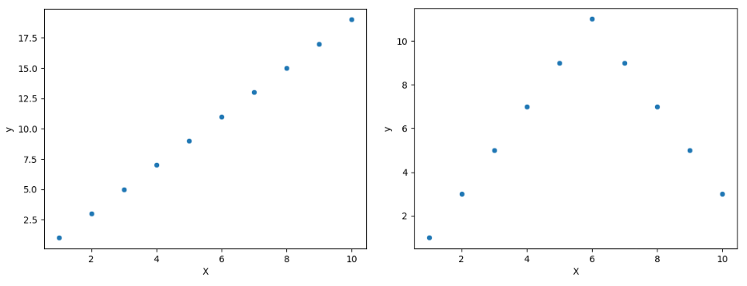{: .align-center  width="75%" height="75%"}

왼쪽 산점도의 경우 x가 증가하면 y가 증가하는 양상처럼 직선관계의 그래프를 볼 수도 있고  
오른쪽 산점도와 같이 곡선 형태의 그래프가 나타날 수도 있는다.  
왼쪽 도표의 경우 단순선형회귀를 통해서 쉽게 분석할 수 있지만  
오른쪽 도표의 경우에는 곡선회귀(비선형회귀, Curvelinear, Non-linear) 또는 다항회귀(Polynomial)를 사용해야한다.

먼저, 회귀모형의 기본 가정에 대해 알아보자 <br/><br/>

---
<br/>

# 1. 단순회귀모형 기본가정

1. 주어진 X의 값에서 y의 기대값을 뮤_xy라고 할 때 아래와 같은 선형식으로 표현할 수 있다.(선형성)
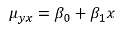{: .align-center  width="20%" height="20%"}
2. 주어진 X의 값에서 y는 정규분포를 따라야 하며, 평균은 X값에 따라 달라질 수 있으나 분산은 X값에 관계 없이 일정하다.(정규성, 등분산성)
3. y는 확률변수이며, y의 측정오차들은 서로 독립이다. (독립성)

위 가정들을 단순선형회귀모형으로 나타내면 아래와 같다.
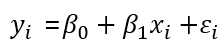{: .align-center  width="20%" height="20%"}

위 식에서 종속변수 y와 오차항은 아래와 같은 정규분포를 따른다.
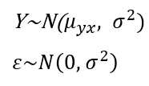{: .align-center  width="20%" height="20%"}
  
따라서 단순회귀분석은 선형성, 정규성, 등분산성, 독립성을 따라야 한다.  
자세한 내용은 필요할 때 회귀분석(박성현, 75p) 책을 보자 <br/><br/>

---

<br/>

# 2. 회귀선 추정
회귀모형의 기본가정(1)에서 아래와 같은 선형식을 얻을 수 있었다. <br/>
{: .align-center  width="20%" height="20%"}

해당 선형식을 추정하여 얻은 직선을 아래와 같다고 할 때, 해당 직선을 추정된 회귀직선이라고 한다.
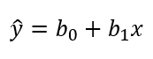{: .align-center  width="20%" height="20%"}

각각의 변수와 계수는 기본가정(1) 식의 추정값이다.

이 식으로부터 우리가 해야할 것은 관찰된 데이터를 가장 잘 적합시킬 수 있는 추정된 회귀선을 찾는 것이다.  
이러한 적합도를 비교하기 위한 표준이 여러가지 있는데 이어서 간략하게 살펴보자

**1. 최소제곱법(method of least sqaures = least square method)**
- 간략히 설명하면 최소제곱법은 관찰된 데이터로부터 오차가 최소가 되는 계수를 찾는 방법이다.
- 오차항이 정규분포를 따른다는 가정이 없을 때도 적용될 수 있다.

우리는 앞서 회귀모형을 아래와 같이 나타냈다. <br/>
{: .align-center  width="20%" height="20%"}

최소제곱법은 여기서 오차제곱들의 합을 최소화하는 절편과 기울기를 구하는 것이다. <br/>
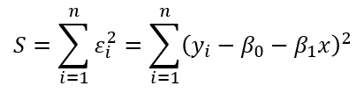{: .align-center  width="20%" height="20%"}

오차제곱합 S를 최소화시키는 계수를 얻기 위해 각 각의 계수로 편미분을 진행하여 정규방정식을 얻는다.  
이렇게 얻어진 해는 S가 최소화한다는 필요조건이지 충분조건은 아니기 때문에 이차편미분을 진행하고,  
이차편미분 행렬이 양정치행렬임을 밝혀야한다. <span style="color=gray"> ※ 자세한 내용은 회귀분석(박성현, 78p)를 참고하자. </span>  
이러한 과정을 통해 얻어는 절편과 기울기의 추정량을 최소제곱추정량(least squares estimator)라고 부른다.  


**2. 최우추정법(method of maximum likelihood estimation)**
- 오차항이 정규분포를 따를 때, 각 관찰점에서의 오차들은 평균이 0이고 분산이 시그마 제곱인 정규분포에서 얻어지는 확률표본이며,  
정규분포를 따르는 오차들의 확률밀도함수의 곱은 아래와 같은 우도함수(likelihood function)로 표현된다.  
이 때, 우도함수를 최대로 크게하는 절편과 기울기를 구하는 방법이 최우추정법이고 추정량은 최우추정량이라 부른다.

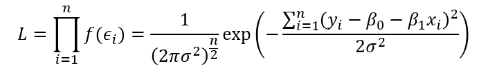{: .align-center  width="50%" height="50%"} <br/><br/>

---
<br/>

# 3. 회귀선의 정확성 측정

적합된 회귀선에는 다섯가지 성질이 존재하지만 생략하고,  
이어서 회귀선이 주어진 자료를 잘 대변하는 가를 측정하는 방법인 표준오차와 결정계수에 대해 알아보자

**1. 표준오차**
- 선형회귀모형에서 오차항은 상호 독립이며 평균이 0이고 분산이 시그마제곱인 정규분포를 따르고, x값에 관계없이 분산이 동일하다고 가정하였다.   
여기서 앞서 우리가 구한 회귀선 근처에 관찰된 y들이 모두 가깝게 있다면 분산의 추정값은 작아질 것이다.  
이때의 평균제곱편차는 분산의 불편추정량(unbiased estimate)이 되고 루트를 씌워 회귀선의 정확성을 측정하는 측도로써 표준오차(표본표준편차)로 사용한다.

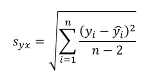{: .align-center  width="20%" height="20%"}

**2. 결정계수**
- 회귀선에서 설명되는 편차와, 설명되지 않는 편차, 총편차의 제곱합으로부터 각 변동을 구하고,   
결정계수는 총변동 중에서 회귀선에 의하여 설명되는 비율을 말한다.
- 범위는 0 <= 결정계수 <= 1이다. 

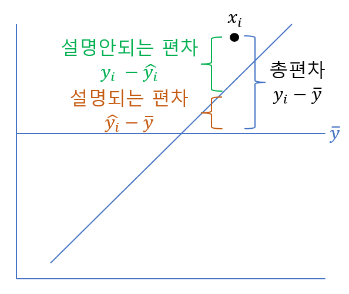{: .align-center  width="40%" height="40%"} <br/><br/>

---

<br/>

# 4. 예제 : boston

보스턴 주택 가격 데이터셋의 일부를 갖고 단순선형회귀분석을 해보자  
X = town별 1인당 범죄율  
y = 본인 소유 주택가격(median, $1,000) <br/>

**1단계 : y의 정규성 확인**
```python
import pandas as pd

boston = pd.read_csv('https://raw.githubusercontent.com/Sketchjar/MachineLearningHD/main/boston_data.csv')
boston.info()

boston['Target'].hist()
```

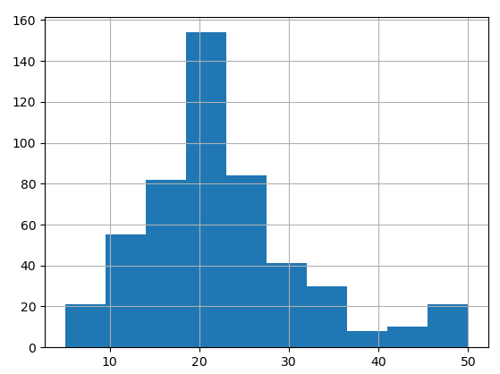{: .align-center  width="70%" height="70%"}

오른쪽 꼬리가 길어보이지만 정규성에 크게 문제 되지 않는다.  <br/>

**2단계 : 잔차도표 확인**

- 산점도 확인

```python
import pandas as pd
import seaborn as sns

boston = pd.read_csv('https://raw.githubusercontent.com/Sketchjar/MachineLearningHD/main/boston_data.csv')
boston.info()

sns.scatterplot(x=CRIM', y='Target', data=boston)
```

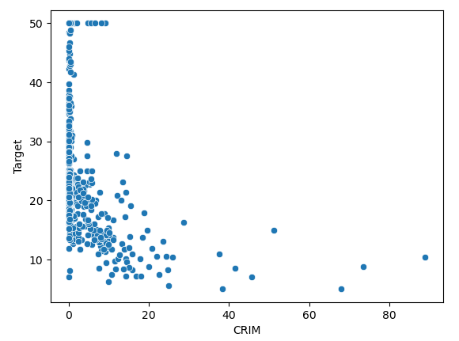{: .align-center  width="70%" height="70%"}

두 변수의 산점도에서 데이터가 왼쪽에 치우쳐져있다. 이는 CRIM 변수의 영향으로 로그변환을 해주었다. <br/>

- 잔차도표 확인

```python
import statsmodels.api as sm
import pandas as pd
import seaborn as sns
import matplotlib.pyplot as plt
import numpy as np
import scipy.stats

boston = pd.read_csv('https://raw.githubusercontent.com/Sketchjar/MachineLearningHD/main/boston_data.csv')
boston.info()

X = np.log(boston.CRIM)
y = boston.Target

X = sm.add_constant(X)

fitted = sm.OLS(y, X).fit().predict()
residual = y - fitted

sr = scipy.stats.zscore(residual)
sns.regplot(fitted, np.sqrt(np.abs(sr)), lowess=True, line_kws={'color' : 'red'})
```

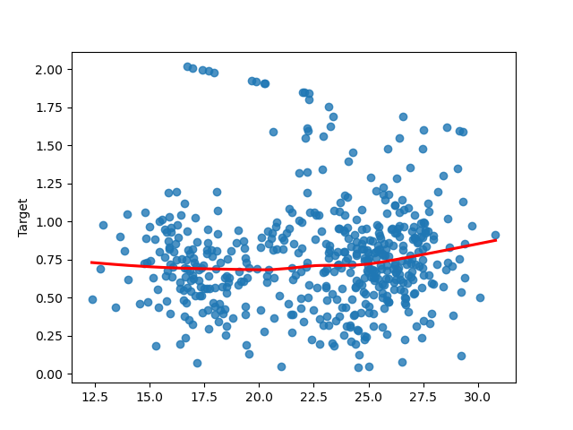{: .align-center  width="70%" height="70%"}

일정한 패턴이 보이지 않고, 표준편차 (-3, 3) 사이에 값들이 모두 존재하므로 이상없는 것으로 판단된다. 

**3단계 : 회귀분석**
```python
import statsmodels.api as sm
import pandas as pd

boston = pd.read_csv('https://raw.githubusercontent.com/Sketchjar/MachineLearningHD/main/boston_data.csv')
boston.info()

X = boston.CRIM
y = boston.Target

X = sm.add_constant(X)
sm.OLS(y, X).fit().summary()
```

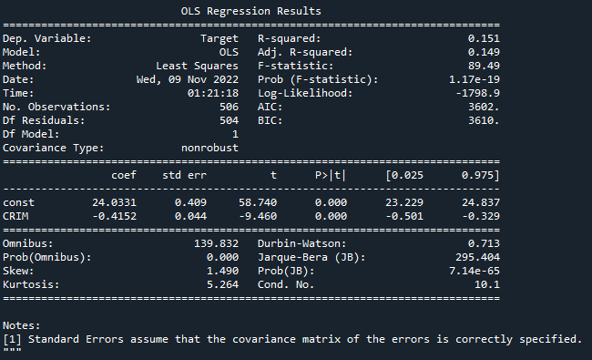{: .align-center  width="70%" height="70%"}

절편과 기울기의 계수는 모두 유의하고,   
결정계수는 0.151로 town별 1인당 범죄율이 보스턴 주택 가격이라는 종속변수를 완벽히 설명하지 못한다고 볼 수 있다.